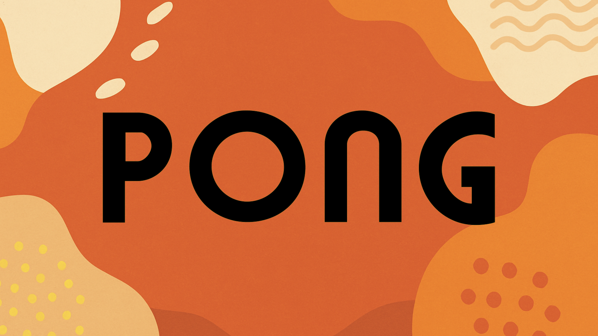

# 🎮 PolarisPong by Polaris Studios v0.5 (Work in Progress)

**PolarisPong** is the first game built using **PolarisKit**, my lightweight, modular starter kit for developing 2D games with Pygame.  
It’s designed to be fully replayable, polished, and a complete example of what PolarisKit can deliver.

This project is **a work in progress** and will showcase PolarisKit's core features, including **Scene Management**, **Asset Management**, **Save Management**, and **Audio Management**, as it evolves toward v1.0.

## 💡 Why Pong?

**Pong is a simple, classic game**, making it the perfect first test case for PolarisKit.

It requires a complete game loop with clear transitions. It also exercises the scene system, asset loading, input flow, and save/load functionality.

**PolarisPong demonstrates that PolarisKit can deliver a small, polished game with persistent save/load and achievements.**

## 🗒️ Notes

**PolarisPong** is intentionally simple:

- First goal: ship a complete small game built with PolarisKit v2
- Second goal: demonstrate clean **Save/Load**, **Stats**, and **Achievements** using PolarisKit patterns  
- Third goal: establish a clean example of how PolarisKit can power **small retro games** for the **Polaris Company** and the **M64 console** project  

## 🏓 Current Features (v0.5)

✅ Intro Scene  
✅ Kit Scene *(PolarisKit splash image)*  
✅ Title Scene with **Mode Select**  
- Start Match  
- Achievements  
- Customize  
- Settings  

✅ Settings Scene  
- Delete/Create Save  
- Toggle FPS Showing  
- Credits  

✅ Credits Scene  
- Lead Developer  
- Lead Designer  
- Lead Sound Design  

✅ Customize Scene with early options:  
- **Ball Skins:** Orange, Blue, Green, Purple (Normal Skins)  
- **Paddle Skins:** Orange, Blue, Galaxy Paddles  
- **Backgrounds:** Classic Black, Classic White, Soccer Field  

✅ Achievements Scene *(WIP)*  
✅ Main Gameplay Scene *(Player vs CPU)*  
✅ Pause Menu  
- Q to Quit Game  
- B to Go Back to previous Scene (Push/Pop)  

✅ Simple **Save/Load System** *(Skins, Stats, Achievements in progress)*  
✅ **Music and SFX** support  
- Ball bounce, paddle hit, score sounds  
- Main Menu Music

## 🚀 Planned Features (v1.0 Roadmap)

### More Customization Options
- Ball Skins: Soccer ball, Baseball, Basketball, Classic Pong ball, more
- Paddle Skins: Neon paddle, Wooden paddle, Hockey stick paddle, Tech paddle
- Backgrounds: Soccer pitch, Hockey rink, Dirt field, Grass field, Tech grid

### Game Modes
- Speed Ball
- Rally Mode
- Paddle Size Randomizer

### Gameplay Enhancements
- Charged Shot mechanic (Player + CPU)  
- Match End screen (You Win! / CPU Wins!)  
- Stats screen (Games Played, Games Won, Longest Rally)  
- Additional Skins and Backgrounds  

### Achievements (Draft List)
- **First Win** → Win your first match  
- **5 Wins** → Win 5 matches total  
- **10 Wins** → Win 10 matches total  
- **50 Wins** → Win 50 matches total  
- **Longest Rally 10** → Reach a rally of 10 hits  
- **Longest Rally 50** → Reach a rally of 50 hits  
- **Longest Rally 100** → Reach a rally of 100 hits  
- **Win with Speed Ball Mode**  
- **Win with Paddle Size Randomizer**  
- **Win using a Custom Skin** (ball, paddle, or background customized)  
- **Shutout Win** → Win a match without allowing a single point  
- **Achievement Hunter** → Unlock all other achievements  

Achievements will be saved between sessions and displayed in the Achievements Scene.

## Built on PolarisKit v2.0

PolarisKit currently provides:

✅ Direct **SceneManager stack system** (Intro, Title, Game, Pause, Achievements, Match End)  
✅ Global **Pause system** (ESC key from anywhere)  
✅ Simple **Asset + Sound loader** (images, SFX, fonts)  
✅ Clean and scalable **folder structure**  
✅ Scene lifecycle: **on_enter()**, **on_exit()**  
✅ Built-in **Save/Load system** (Stats and Achievements)
✅ Built-in **Audio Manager** (SFX and Music)

## 🔒 Code Access

> The codebase is currently **private**. 

## Built By

Marco @ **SB Studios**  
[GitHub](https://github.com/marcogonzalez99) · [LinkedIn](https://www.linkedin.com/in/marco-a-gonzalez99)
