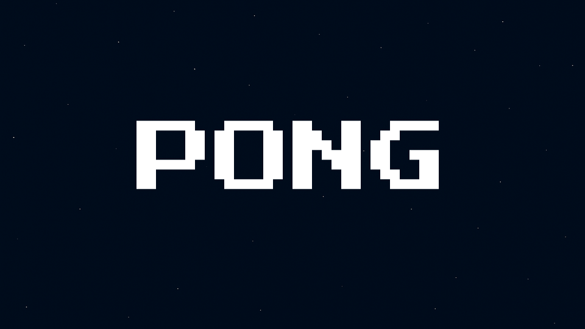

  

# 🏓 PolarisPong v1.0

**PolarisPong** is the first game built using **PolarisKit**, our lightweight, modular starter kit for developing 2D games with Pygame.  
It’s designed to be **fully replayable**, **polished**, and a **complete example** of what PolarisKit can deliver.

---

## 📜 Why Pong?

Pong is **simple** and **classic**, making it the perfect first test case for PolarisKit.  

It requires:
- A complete game loop with clear transitions
- Scene stack handling
- Asset loading
- Input flow
- Save/load persistence

**PolarisPong proves that PolarisKit can deliver a small, polished game with persistent save/load, multiple game modes, customization, and achievements.**

---

PolarisPong v1.0 marks the first completed game built on PolarisKit! A milestone for SB Studios.

---

## 🌌 PolarisPong Challenge

Think you’re good at Pong? Prove it.

PolarisPong hides a secret **challenge** inside its achievements.  
Solve the puzzle, and you could earn your place in the **Polaris Hall of Fame** and a cash prize.  

➡️ Follow [SB Studios on Instagram](https://www.instagram.com/sbstudios.project/) for details, hints and prize announcements.  

---

## ✅ Features (v1.0.0)

### 🏆 Achievements System  
- Fully functional and saved between sessions  
- Covers:  
  - Total wins  
  - Rally milestones  
  - Mode-specific victories  
  - Final **Pong Legend** achievement (unlocked once all others are earned)  
- Achievements displayed with name + description in the Results screen  

### 🎮 Game Modes  
- **Classic** - the standard mode  
- **Speed Ball** - ball velocity increases over time  
- **Power Cycle** - random power shots  
- **Paddle Size Shuffler** - paddle sizes change randomly  
- **Paddle Speed Shuffler** - paddle speed changes randomly  

### 🎨 Customization  
- **Ball Skins**: Blue, Green, Purple, Red, Shaded Blue, Shaded Green, Shaded Purple, Shaded Red  
- **Paddle Skins**: Black, White, Blue, Cloud Pattern, Cyan, Galaxy, Green, Red, Purple, Neon Variants  
- **Backgrounds**: Black, White, Grassy Soccer, Soccer, Basketball  

### 💾 Save System  
- Stores skins, stats, achievements, and settings  
- Saves persist between sessions  

### 🎬 Scenes  
- Intro Scene  
- PolarisKit Splash Scene  
- Title Scene (Mode Select, Achievements, Customize, Settings)  
- Settings Scene (Create/Delete Save, Toggle FPS, Credits)  
- Achievements Scene  
- Results Scene (displays wins, rallies, and new achievements)  
- Main Gameplay Scene (Player vs CPU)  
- Pause Menu (Quit, Resume, Back)  

### 🎵 Audio  
- Ball bounce, paddle hit, and scoring sounds  
- Main menu music  
- Music and SFX manager built into PolarisKit  
- Background music fades and transitions  

---

## 🏆 Achievements List

- **First Victory** – Win your first match  
- **Five-Time Champ** – Win 5 matches total  
- **Decathlon Hero** – Win 10 matches total  
- **Serial Winner** – Win 25 matches total  
- **Rally Artist** – Reach a rally of 10 hits  
- **Rally Pro** – Reach a rally of 25 hits  
- **Rally Legend** – Reach a rally of 50 hits  
- **Rally Mythic** – Reach a rally of 100 hits  
- **Classic Winner** – Win 5 Classic matches  
- **Speed Demon** – Win 5 Speed Ball matches  
- **Power Lifter** – Win 5 Power Cycle matches  
- **Morph Master** – Win 5 Paddle Size Shuffler matches  
- **Fast Mover** – Win 5 Paddle Speed Shuffler matches  
- **Pong Legend** – Unlock all achievements  

---

## 📥 Getting the Game

PolarisPong is distributed through:  
- **Ko-fi**: [ko-fi.com/sbstudios](https://ko-fi.com/sbstudios)  
- **Itch.io**: [itch.io/polaris-studios](https://polaris-studios.itch.io/)  

⚠️ **Note:** Source code is not publicly available. The distributed package includes only playable builds.  

---

## 🚀 Future Additions

While PolarisPong is considered **feature complete**, future updates may expand achievements, add skins, or improve polish.  

---

## 🛠 Built on PolarisKit v2.0

PolarisKit currently provides:

- **SceneManager stack system** (Intro, Title, Game, Pause, Achievements, Results)
- **Global pause system** (ESC from anywhere)
- **Asset + Sound loader** for images, SFX, fonts
- **Scene lifecycle** methods: `on_enter()` / `on_exit()`
- **Save/Load system** for stats, skins, achievements
- **Audio Manager** for SFX and Music
- **Clean, scalable folder structure**

---

## 🔒 Code Access

> The codebase is currently **private**.

---

## 📜 License

This project is licensed under a **proprietary SB Studios license**.  
See the [LICENSE](LICENSE) file for details.  

---

## 👤 Built By

Marco @ **SB Studios**  
[GitHub](https://github.com/marcogonzalez99) · [LinkedIn](https://www.linkedin.com/in/marco-a-gonzalez99) · [Ko-fi](https://ko-fi.com/sbstudios)
